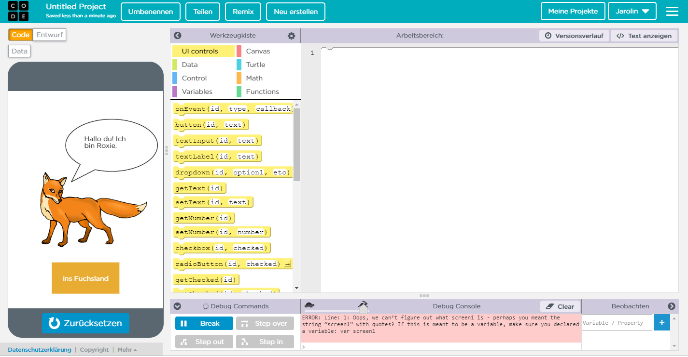

# PROJEKT 2

# Blog

### Erste Informatikstunde, 27.11.18

In der ersten Stunde hat Herr Buhl uns weitere Möglichkeiten für das Projekt für das zweite Halbjahr vorgeschlagen bzw. vorgestellt. 
Zunächst haben wir überlegt, genau wie bei unsererm vorherigen Projekt "App Inventor" zum Programmieren zu verwende. Da wir jedoch beide ein Apple Smartphone und kein Android besitzen, wäre dies etwas unpraktisch. 
Um die gleichen Probleme wie bei unserem vorherigen Projekt zu vermeiden, nämlich das zu Seltene Ausprobieren des Programmierten, hatten wir die Idee mit App Lab zu programmieren.

Wir haben uns bei Klassenkameraden, die damit ihr letztes Projekt programmeirt haben erkundigt und nur positives Feedback bekommen. 
Deshalb haben wir uns bei App Lab einen Account erstellt und begonnen, uns mit dem Progrmm vertraut zu machen. 
Wir haben uns den Aufbau des Programms angeschaut und bei den Blocks einige Ähnlichkeiten zu App Inventor entdeckt. Dennoch mussten wir uns einige YouTube Tutorials ansehen. 
Interessant fanden wir ebenfalls die Möglichkeit Animationsfilme zu erstellen.

### Zweite Informatikstunde, 03.12.18

Heute haben wir unser zweites Projekt auf GitHub erstellt. Dazu haben wir einen neue Projetseite angelegt und begonnen den neuen Stundenblock zu schreiben.
Anschließend haben wir uns weiter mit AppLab vertraut gemacht. Des Weiteren ksmen uns erste Ideen für ein Projekt. Eventuell wollen wir eine Wissensapp erstellen, allerdings sind wir uns da noch nicht einig.

### Dritte Informatikstunde, 11.12.18

Heute haben wir unser erstes Projekt benotet zurückbekommen. Wir haben uns sehr darüber gefreut, dass unsere Arbeit so positive Rückmeldung bekam.
Außerdem durften wir unser Projekt der Klasse vorgestellen und präsentieren.
Den Rest der Stunde haben wir weitere Ideen gesammelt für ein neues Projekt. 

### Vierte Informatikstunde, 17.12.18

Heute haben wir leider beide beim Informatikunterricht gefehlt, Janina aufgrund von Krankheit, Carolin wegen eines Arztbesuchs. Dennoch haben wir zu Hause an dem Projekt weitergearbeitet. 
Wir haben... am blog

### Fünfte Informatikstunde, 18.12.18

Heute haben wir uns in App Lab versucht hereinzuarbeiten und dazu den potenziellen Startbildschirm für unsere App kreiert.

