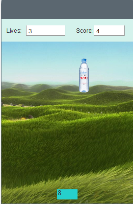

# PROJEKT 2

# Blog

### Inhaltsverzeichnis

## Inhaltsverzeichnis
* [Erste Informatikstunde, 27.11.2018](#27.11)
  * [Zweite Informatikstunde, 03.12.2018](#3.12)
    * [Dritte Informatikstunde, 11.12.2018](#11.12)
* [Vierte Informatikstunde, 17.12.2018](#17.12)
* [Fünfte Informatikstunde, 18.12.2018](#18.12)
* [Sechste Informatikstunde, 08.01.2019](#8.1)
* [Siebte Informatikstunde, 15.01.2019](#15.01)
* [Achte Informatikstunde, 21.01.2019](#21.01)
* [Neunte Informatikstunde, 20.01.2019](#20.01)
* [Zehnte Informatikstunde, 29.01.2019](#29.01)
* [Elfte Informatikstunde, 04.02.2019](#4.02)
* [Zwölfte Informatikstunde, 12.02.2019](#12.02)
* [Dreizehnte Informatikstunde, 19.02.2019](#19.02)
* [Vierzehnte Informatikstunde, 25.02.2019](#25.02)
* [Fünfzehnte Informatikstunde, 26.02.2019](#26.02)
* [Sechzehnte Informatikstunde, 04.03.2019](#4.03)
* [Siebzehnte Informatikstunde, 05.03.2019](#5.03)
* [Achzehnte Informatikstunde, 18.03.2019](#18.03)
* [zu Hause ](#hause)
* [Neunzehnte Informatikstunde, 25.03.2019](#25.03)
* [Zwanzigste Informatikstunde, 26.03.2019](#26.03)
* [Ausblick auf die weitere Arbeit ](#ausblick)
* [Rückblick auf bisherige Arbeit ](#rückblick)

### Erste Informatikstunde, 27.11.18 

In der ersten Stunde hat Herr Buhl uns weitere Möglichkeiten für das Projekt für das zweite Halbjahr vorgeschlagen bzw. vorgestellt. 
Zunächst haben wir überlegt, genau wie bei unsererm vorherigen Projekt, "App Inventor" zum Programmieren zu verwenden. Da wir jedoch beide ein Apple Smartphone und kein Android besitzen, wäre dies etwas unpraktisch. 
Um die gleichen Probleme wie bei unserem vorherigen Projekt zu vermeiden, nämlich das zu seltene Ausprobieren des Programmierten, hatten wir die Idee mit App Lab zu programmieren.

Wir haben uns bei Klassenkameraden, die damit ihr letztes Projekt programmeirt haben erkundigt und nur positives Feedback bekommen. 
Deshalb haben wir uns bei App Lab einen Account erstellt und begonnen, uns mit dem Progrmm vertraut zu machen. 
Wir haben uns den Aufbau des Programms angeschaut und bei den Blocks einige Ähnlichkeiten zu App Inventor entdeckt. Dennoch mussten wir uns einige YouTube Tutorials ansehen. 
Interessant fanden wir ebenfalls die Möglichkeit bei AppLab Animationsfilme zu erstellen.

### Zweite Informatikstunde, 03.12.18

Zunächst haben wir unser zweites Projekt auf GitHub erstellt. Dazu haben wir eine neue Projektseite angelegt und begonnen,den neuen Stundenblock zu schreiben.
Anschließend haben wir uns weiter mit AppLab vertraut gemacht. Desweiteren kamen uns erste Ideen für ein Projekt.
Eventuell wollen wir eine Wissensapp erstellen, allerdings sind wir uns da noch nicht einig.
Wir haben bereits bei unserer vorherigen App bemerkt, dass uns beiden sehr wichtig ist, dass Apps nicht ausschließlich zum Spaßhaben existieren. Neben dem Spaßfaktor sollte der Spieler unserer Ansicht nach auch etwas daraus lernen. 
Somit kann man es nicht als "Zeitverschwendung" bezeichnen, das Produkt hinterher zu spielen, der einzelne Spieler nimmt etwas daraus mit, egal, ob es sich um das Erweitern von Wissen oder seine Persönlichkeitsentwicklung handelt. 

### Dritte Informatikstunde, 11.12.18

Heute haben wir unser erstes Projekt benotet zurückbekommen. Wir haben uns sehr darüber gefreut, dass unsere Arbeit so positive Rückmeldung bekam. Dies zeigt einem, dass es sich gelohnt hat, so viel Zeit und Mühe in das Informatikprojekt zu stecken. Außerdem motiviert es einen ebenfalls am neuen Projekt sehr engagiert zu arbeiten. 
Im Zuge der Rückmeldungen zu unseren Projekten durften wir unser Projekt vor der Klasse präsentieren und vorstellen. Es hat uns sehr gefallen, dass wir auch einzelne andere Projekte von Mitschülern vorgestellt bekamen. Dies inspiriert einen und zeigt einem, wie unterschiedlich die Ergebnisse am Ende der Arbeitsphase doch geworden sind. Außerdem konnte man Differenzen des eigenen zu anderen Programmierprogrammen feststellen, was uns bei der Entscheidung bekräftigte, dass wir es bei dem zweiten Projekt mit dem für uns neuen Programm AppLab versuchen wollen. 
Den Rest der Stunde haben wir weitere Ideen für unser neues Projekt gesammelt.

### Vierte Informatikstunde, 17.12.18

Heute haben wir leider beide beim Informatikunterricht gefehlt, Janina aufgrund von Krankheit, Carolin wegen eines Arztbesuches. Dennoch haben wir zu Hause weitergearbeitet. 
Wir haben unter anderem den Blog der ersten Informatikstunden verbessert. 
Außerdem haben wir mit dem Gedanken gespielt, die Gestaltung einer Homepage als neues Projekt zu wählen. Dafür würde sprechen, dass uns dies im späteren Leben ebenfalls zu Gute kommen könnte, beispielsweise wenn wir selbstständig werden möchten.
Auch möchte Carolin schon länger eine Homepage für ihre eigenen Kurzfilme erstellen, was sich mit dem Informatikprojekt verbinden lassen würde. 
Dennoch haben wir uns letztendlich für das Erstellen einer App entschieden, da uns dies spannender erschien und Carolin nicht so gerne eine Art "Selbstdarstellung" als Schulprojekt machen wollte. ;)

### Fünfte Informatikstunde, 18.12.18

Heute haben wir uns in App Lab versucht hinein zu arbeiten und dazu den potenziellen Startbildschirm für unsere App kreiert.

Verbunden mit diesem haben wir konkretere Ideen für unsere Appidee gesammelt. 
Ein sogenannter "Protagonist" soll den Spieler durch das Geschehen leiten, momentan ist dies ein Fuchs. 
Die App soll, wenn möglich, in mehrere Ebenen unterteilt sein. Eine Spielebene, eine Quizebene und eine Testebene. 
Die App ist somit eine Art "Spielplatz" für den Spieler, der sich in verschiedenen Bereichen ausprobierern kann. 
Über das konkrete Thema unserer App waren wir uns noch nicht einig. 
Für zu Hause nahmen wir uns vor, uns über die Ferien gedanken darüber zu machen und weiter an dem Design unserer App zu feilen. 

### Sechste Informatikstunde, 08.01.2019

Wir haben in der heutigen Informatikstunde den zweiten Screen erstellt, also das "Fuchsland". Man kommt dahin, indem man auf Screen1 auf den Button 1 ("ins Fuchsland") drückt. 

Unser Problem ist im Moment, dass wir nicht herausfinden, wie man in die if-Schleifen bestimmte Befehle, die wir von App-Inventor kennen, einfügt, da sie nicht als Block gibt. So brauchen wir zum Beispiel so etwas wie "If Button 1 is touched, open Screen2".

Über die Ferien kam uns die Idee, dass unsere App etwas mit dem Thema Klimaschutz zu tun haben soll. Wir finden beide, dass Klimaschutz ein sehr wichtiges Thema in unserer Gesellschaft ist. 
Auch die aktuell gefeierte 16-jährige Klimaaktivistin Greta Thunberg und die mit ihr verbundenen "FridaysForFuture" - Klimademonstrationen verhalfen uns zu der Idee für unsere App.
Da unsere App als besondere Zielgruppe Kinder und Jugendliche haben soll, könnte sie dazu beitragen, dass sich noch mehr junge Leute der aktuellen Bewegung anschließen und so sensibel für das Thema werden, dass sie selber etwas dazu beitragen wollen. Damit wäre der bereits angesprochene Lerneffekt, der uns beiden wichtig ist, erfüllt.

### Siebte Informatikstunde, 15.01.2019

Da die letzte Stunde ausgefallen ist, haben wir uns zu Hause intensiv mit dem Projekt beschäftigt. Dabei ist uns aufgefallen, dass uns das Design von App Inventor doch besser gefällt. Damit haben wir unser vorheriges Informatikprojekt programmiert. 
Zwar hatte App Inventor einige Nachteile, zum Beispiel dass wir unsere App nicht auf unseren iPhones ausprobieren konnten.
Aber mit App Inventor haben wir sehr viel mehr Erfahrung und können eventuell auch erst mal vieles programmieren und später mit Hilfe von Personen mit einem Android Handy das Programmierte ausprobieren. 

### Achte Informatikstunde, 21.01.2019

Heute haben wir nach einigen technischen Problemen auf App Inventor unser Projekt so weit übertragen, wie wir es bereits auf App Lab erstellt hatten. Unser einziges Problem ist, dass man auf App Inventor eine Grenze in der Anzahl von Screens hat. Für unsere Idee benötigen wir jedoch vorraussichtlich mehr als zehn verschiedene Screens. Wir hatten die Idee, dass man eventuell mehrere Canvas in einen Screen legt und die App so programmiert, dass die Canvas pro Screen gewechselt werden können. 

### Neunte Informatikstunde, 22.01.2019

In der heutigen Informatikstunde haben wir unsere Idee für unser Projekt konkretisiert. Der Fuchs soll weiterhin durch das Spiel leiten, jedoch hat unsere App nun ein spezielles Thema: Klimaschutz.
Weiterhin soll es die verschiedenen Bereiche in der App geben. In der Spielebene wird ein Spiel gespielt, dessen Konzept wir uns noch genauer überlegen müssen. Dabei soll der Spieler jedoch virtuell "die Welt retten", zum Beispiel Müllstücke auffangen. In der Quizebene wartet ein Quiz auf den Spieler, in welchem er sein Wissen über den Klimaschutz testen kann. 
Dort werden Fragen zu den Ursachen, Konsequenzen und Möglichkeiten sich für das Klima einzusetzen getestet.
In der Testebene findet der Spieler einen Persönlichkeitstest, im dem er testen kann, ob er bereits genug für den Klimaschutz tut. 

### Zehnte Informatikstunde, 29.01.2019

Wir haben momentan das Problem, dass wir unser Projekt sowohl auf AppLab begonnen haben, als auch auf AppInventor damit gestartet haben. 
Da wir nun aber besser mit AppLab klar kommen und auch schon einige Blocks erstellen konnten, haben wir uns nun endgültig für AppLab entschieden. 
Hier die ersten Eindrücke von unseren Startscreens für die einzelnen Ebenen.

 
 
 
 
 
 
 ### Elfte Informatikstunde, 04.02.2019
 
 
 Heute haben wir weiter an den einzelnen Screens garbeitet und uns dabei erstmal auf das Design und die Bezeichnungen für die verschiedenen Screens und Buttons konzentriert. Danach haben wir für die Quizebene drei Fragescreens erstellt, die um den Klimaschutz gehen. 
 
 Da morgen die Doppelstunde ausfällt, haben wir heute zudem zu Hause weiter an dem Projekt gearbeitet.
 
 
 ### Zwölfte Informatikstunde 12.02.2019
 
 Aufgrund von Ausfall der Informatikstunden zuvor haben wir in der Zwischenzeit zu Hause an unserem Projekt weitergearbeitet. 
 Insbesondere am Design der Screens haben wir Veränderungen vorgenommen.
Zu Beginn der zwölften Informatikstunde ließ sich aufgrund von Fehlern im Code nicht mehr von der Textansicht zur Bausteineansicht wechseln. Somit mussten wir zunächst versuchen, den Fehler zu finden und zu korrigieren. 
Dies wäre in der Bausteineansicht sehr viel leichter und übersichtlicher gewesen und es kostete Zeit, bis wir ein paar einzelne Klammern so verändert hatten, dass das Programm sich wieder umschalten ließ. 
Anschließend haben wir uns eine weitere Frage zum Klimawandel ausgedacht, das Design dieser erstellt und die notwendigen Befehle programmeirt. Wir haben uns ebenfalls den Erklärtext ausgedacht.

 
 

 
 ### Dreizehnte Informatikstunde 19.02.2019
 
 Heute haben wir intensiv an unserem Projekt weitergearbeitet. Aufgrund der vielen verschiedenen Antwortmöglichkeiten und dem damit verbundenem Öffnen verschiedener Screens, ist unsere Programmierung etwas unübersichtlich geworden. 
Somit haben wir etwas den Überblick verloren, welche Programmierungen und Buttons bereits funktionieren und welche noch nicht. 
Deshalb haben wir uns heute vorgenommen, dies intensiv mit Hilfe eines Baumdiagramms zu überprüfen. Wir haben alle möglichen Kombinationen von Antwortmöglichkkeiten ausprobiert und hinter funktionierende Pfade einen Haken gesetzt. Einzelne Blöcke haben jedoch nicht funktioniert, weswegen wir im Code nach Fehlern suchen mussten.
Manchmal waren die enstprechenden Programmierungen bereits vorhanden und nur in einer Zeile verrutscht oder an der falschen Stelle in den Code eingefügt. 
Auch fehlte ab und zu eine einzelne Klammer, sodass der gesamte Befehl wirkungslos wurde. 
Am Ende der Stunde haben wir beinahe das gesamte Baumdiagramm fertig stellen können und in den bereits überprüften Pfaden alle Fehler beheben können. Die restlichen Pfade müssen wir nächste Stunde noch überprüfen.
 
 
 ### Vierzehnte Informatikstunde 25.02.2019
 
 In der heutigen Informatuikstunde haben wir mit dem Überprüfen der einzelnen Pfade weitergemacht. Jedoch ist uns aufgefallen, dass die Programmierung trotz am Ende vorhandener Funktionalität viel zu umständlich, kompliziert und unübersichtlich geworden ist. 
 Aus diesem Grund haben wir uns nach einem kurzen Beratungsgespräch mit Herr Buhl dazu entschlossen, dass wir versuchen wollen eine Lösung zu finden, sodass einzelne Befehle zusammengefasst werden können und diese vielen Pfade wegfallen. 
 Zu Hause möchten wir uns mit Hilfe von Tutorials darüber informieren, ob und inwiefern  dies möglioch ist. 
 Auch haben wir heute die Deadline für unser Projekt mit Herrn Buhl besprochen. Daraufhin haben wir uns einen Plan gemacht, was wir bis wann fertig haben möchten, damit wir das Projekt trotz unserer zahlreichen Klausuren und der Abiturvorbereitung rechtzeitig fertigstellen können.
 Auch haben wir darüber nachgedacht, ob es zeitlich machbar ist, alle drei geplanten Bereiche des Fuchslandes (Quiz, Test und Spiel) umzusetzen. Wir haben beschlossen, mindestens einen weiteren Bereich bis zur Abgabe fertig zu stellen. Sollte die Zeit reichen, werden wir ebenfalls den dritten Bereich erstellen. Zur Not würde der Bereich "Test" leider wegfallen.
 
 ### Fünfzente Indormatikstunde 26.02.2019
 
Heute war Janina leider krank, weswegen Carolin alleine am Projekt weiterarbeiten musste. 
Janina hat währenddessen zu Hauase weiter nach Lösungen gesucht um unsere Programmierung zu vereinfachen. 
Carolin hat ihre Zeit in der heutigen Doppelstunde der schriftlichen Dokumentierung der letzten beiden Stunden gewidmet und an unserem Projektblog weitergearbeitet.
Außerdem hat sie mit der Gestaltung der Projektseite weitergemacht und dort schonmal den Aufbau unserer App, die Idee dahinter und ihre Intention erklärt.
 Des Weiteren hat Carolin sich Gedanken über den zweiten Bereich unserer App, der Spielebene gemacht. 
 Bis jetzt haben wir sehr viel Zeit in das Programmieren des Quizzes gesteckt, was sich aufgrund der verschiedenen Erklärtexte usw. als komplizierter als zunächst gedacht erwies. 
Bei der Spielebene hatten wir uns bereits vorher überlegt, dass das Spiel ebenfalls klimaschutzbezogen sein soll.
eine mögliche konkrete Idee wäre beispielsweise das Müllfangen. Die Müllverschmutzung ist ein großes Problem unseres Planeten und ein wichtiger Punkt im Klimaschutz. Wenn man in einem Spiel eine Figur einzelne Müllteile fangen oder sammeln lässt und es dafür Belohnungen in Form von Punkten gibt, kann das eine positive Auswirkung auf die Psyche der Spieler haben. 
Durch den Anreiz im Spiel werden sie für das Müllproblem sensibilisiert und achten unterbewusst im echten Leben darauf ihre Müllverschmutzung zu reduzieren oder Müll aufzusammeln. So können durch das Spiel spielerisch wichtige Werte vermittelt werden, die ihm einen Sinn geben und unserer Welt zu Gute kommen. 

### Sechzehnte Informatikstunde 4.3.2019

In dieser Informatikstunde haben wir uns intensiv mit der zweiten Ebene unserer App, dem Spiel, beschäftigt. Zu Hause hatten wir uns beide bereits darüber informiert, mit welchen Befehlen man eine Spielfigur steuern kann.
Bei unserem vorherigen Projekt auf AppInventor hatten wir ebenfalls eine sich bewegende Spielfigur, jedoch geschah das dort mit anderen Befehlen. 
Auf App Inventor musste man ein sogenanntes "Sprite" als Figur verwenden, dieses suchten wir auf AppLAb jedoch vergeblich. 
Schließlich fanden wir heraus, dass auf AppLab einfach "Images" verwendet werden.
Das stellt uns vor ein Problem, denn die Müllobjekte, die der Fuchs einsammeln soll, müssen somit ebenfalls "Images" sein. Jedoch findet man im Internet die meisten Bilder nur mit einem weißen Hintergrund. 
Uns kam die Idee, dass man ein Bild aus dem Internet mit Hilfe alternativer Apps wie Snapchat als "Sticker" zuschneiden könnte und diesen dann verwenden könnte. Jedoch müssen wir zu Hause überprüfen, ob das möglich ist. 
Wir fügten unseren Fuchs in dieser Stunde das Programm ein, jedoch dauerte es trotzdem einige Zeit, bis wir die korrekten Befehle für ihn gefunden hatten. 

### Siebzehnte Informatikstunde 5.3. 2019

In dieser Informatikstunde haben wir die Bewegungsbefehle für den Fuchs fertiggestellt. Anschließend ließ er sich mit den vier Pfeiltasten in alle Richtungen auf dem Canvas bewegen. 
Außerdem haben wir heute eine Funktion eingebaut, dass der Fuchs an den Seiten zurückprallt. 

### Achtzehnte Informatikstunde 18.3. 2019

In den letzten Stunden ist der Informatikunterrricht leider ausgefallen. In der Zwischenzeit haben wir jedoch zu Hause weitergearbeitet. Unter anderem haben wir endlich versucht unser sehr unübersichtliche Programmierung des Quizzes zu vereinfachen. Dies ist nach vielen gescheiterten und langen Versuchen dann auch geglückt. Durch das Einfügen von if- Schleifen und dem Auflösen der zahlreichen Verschachtelungen ist es uns gelungen, dass die Blogs sehr viel übersichtlicher wurden. 

alte Verschachtelungen (noch viel mehr, hier nur kleiner Ausschnitt):

komprimiert:

### zu Hause

Am Wochenende haben Carolin und Janina weiter am Projekt gearbeitet. Wir haben es zum Beispiel geschafft, das Spiel fertig zu programmieren. Es funktioniert so, dass man 20 Sekunden Zeit hat, um so oft wie möglich auf eine Plastikflasche zu klicken, die dabei ständig die Position ändert. Klickt man daneben, verliert man 1 Leben, wovon man 3 hat. Dazu ein paar Eindrücke:

Ein Teil der Programmierung:

Und das Spiel an sich: 

Wir werden aber den Timer nochmal optimieren müssen, da er zu früh anfängt, die Zeit runter zu zählen bzw. ab Sekunde 16 runterzählt.

Außerdem haben wir das Quiz um 3 Fragen erweitert und noch nicht fertige Screens fertiggestellt. Unser Ziel ist es, mindestens 8 Fragen zu haben. So sehen sie zum Beispiel aus:

Auch beim Quiz wollen wir noch einen Score einbauen, daran arbeiten wir gerade. Unser Ziel ist es, dass die richtigen Antworten kontinuierlich gezählt werden und der Spieler am Ende das Gesamtergebnis angezeigt bekommt. 

### Neunzehnte Informatikstunde, 25.03.2019

Heute haben wir unseren Stundenblog nochmal überarbeitet, da wir diesen morgen abgeben müssen. Wir haben noch ein paar Screenshots eingefügt, die unsere Worte veranschaulichen.
Des Weiteren haben wir an dem Score für unsere Quizebene gearbeitet. 

### Zwanzigste Informatikstunde, 26.03.2019

### Ausblick auf die weitere Arbeit

- noch testebene

### Rückblick auf bisherige Arbeit 

Auch wenn unser Projekt zu diesem Zeitpunkt noch nicht abgeschlossen ist, können wir sagen, dass uns die Arbeit wie bereits letztes Mal sehr viel Spaß gebracht hat. 
Wir waren überrascht davon, dass es wider Erwaten doch sehr lange gedauert hat, sich in das neue Programm AppLab hineinzufinden. 
Uns selber würden wir empfehlen, dass wir uns nächstes Mal etwas schneller komplett entscheiden. Dass wir zu Beginn des Projekts sowohl auf AppLab, als auch auf AppInventor angefangen haben, hat uns sehr viel Zeit gekostet. 
Jedoch denken wir auch, dass man erst durch Erfahrung lernt, welches Programm sich für welche Dinge besser eignet. 
Unseren Erfahrungen nach kann auf AppInventor sehr schöne Spiele entwickeln, bei denen sich Bälle oder Sprites auf dem Canvas bewegen. Jedoch finden wir das Design von AppLab ästhetischer und moderner. Desweiteren gibt es bei AppLab kein ScreenLimit, sodass sich dieses Programm besonders gut für das Programmieren von beispielsweise Quizapps eignet. 
Insgesamt sind wir sehr froh, dass wir unser zweites Projekt mit einem neuen Programm gemacht haben, da man so seine Kenntnisse im Programmieren erweitern und dazulernen konnte. 
Auch sind wir dankbar, dass wir durch den Iformatikunterricht in der Schule überhaupt mit dem Programmieren in Berührung kommen konnten. Ehrlich gesagt müssen wir zugeben, dass wir vor der zwölften Klasse ein sehr falsches Bild von Informatik hatten. Die Projekte haben uns gezeigt, dass dies keineswegs nur etwas für Computerfreaks ist. Genauso wichtig sind Ideen, Kreativität und Design. Außerdem spielen Logik und das Suchen nach Intelligenten Lösungen eine große Rolle. Anfangs ist es sehr anstrengend, doch je mehr man in sein Projekt und das Programm hineinfindet, desto mehr Spaß bringt es. 
Wir sind jedenfalls froh diese Erfahrung gemacht zu haben und denken, dass sie einem im späteren Leben an einigen Stellen behilflich sein könnte. 
Dafür möchten wir uns an dieser Stelle noch einmal bedanken. :)
