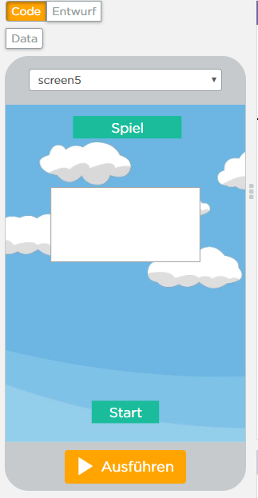

# PROJEKT 2

# Blog

### Erste Informatikstunde, 27.11.18

In der ersten Stunde hat Herr Buhl uns weitere Möglichkeiten für das Projekt für das zweite Halbjahr vorgeschlagen bzw. vorgestellt. 
Zunächst haben wir überlegt, genau wie bei unsererm vorherigen Projekt "App Inventor" zum Programmieren zu verwende. Da wir jedoch beide ein Apple Smartphone und kein Android besitzen, wäre dies etwas unpraktisch. 
Um die gleichen Probleme wie bei unserem vorherigen Projekt zu vermeiden, nämlich das zu Seltene Ausprobieren des Programmierten, hatten wir die Idee mit App Lab zu programmieren.

Wir haben uns bei Klassenkameraden, die damit ihr letztes Projekt programmeirt haben erkundigt und nur positives Feedback bekommen. 
Deshalb haben wir uns bei App Lab einen Account erstellt und begonnen, uns mit dem Progrmm vertraut zu machen. 
Wir haben uns den Aufbau des Programms angeschaut und bei den Blocks einige Ähnlichkeiten zu App Inventor entdeckt. Dennoch mussten wir uns einige YouTube Tutorials ansehen. 
Interessant fanden wir ebenfalls die Möglichkeit Animationsfilme zu erstellen.

### Zweite Informatikstunde, 03.12.18

Heute haben wir unser zweites Projekt auf GitHub erstellt. Dazu haben wir einen neue Projetseite angelegt und begonnen den neuen Stundenblock zu schreiben.
Anschließend haben wir uns weiter mit AppLab vertraut gemacht. Desweiteren kamen uns erste Ideen für ein Projekt. Eventuell wollen wir eine Wissensapp erstellen, allerdings sind wir uns da noch nicht einig.

### Dritte Informatikstunde, 11.12.18

Heute haben wir unser erstes Projekt benotet zurückbekommen. Wir haben uns sehr darüber gefreut, dass unsere Arbeit so positive Rückmeldung bekam.
Außerdem durften wir unser Projekt der Klasse vorgestellen und präsentieren.
Den Rest der Stunde haben wir weitere Ideen gesammelt für ein neues Projekt. 

### Vierte Informatikstunde, 17.12.18

Heute haben wir leider beide beim Informatikunterricht gefehlt, Janina aufgrund von Krankheit, Carolin wegen eines Arztbesuchs. Dennoch haben wir zu Hause an dem Projekt weitergearbeitet. 
Wir haben... am blog

### Fünfte Informatikstunde, 18.12.18

Heute haben wir uns in App Lab versucht hereinzuarbeiten und dazu den potenziellen Startbildschirm für unsere App kreiert.

Außerdem haben wir konkretere Idenn für unsere Spielidee gesammelt. 
Unser Protagonist soll den Spieler durch das Geschehen leiten, momentan ist dies ein Fuchs. 
Das Spiel soll, wenn möglich, in mehrere Ebenen unterteilt werden. Eine Spielebene, eine Quizebene und eine Testebene. Das Spiel ist somit eine Art Spielplatz für den Spieler, der sich in verschiedenen Bereichen ausprobierern kann. 

### Sechste Informatikstunde, 08.01.2019

Wir haben den zweiten Screen erstellt, also das "Fuchsland". Man kommt dahin, indem man auf Screen1 auf den Button 1 ("ins Fuchsland") drückt. 

Unser Problem ist im Moment, dass wir nicht herausfinden, wie man in die if-Schleifen bestimmte Befehle, die wir von App-Inventor kennen, einfügt, da sie nicht als Block gibt. So brauchen wir zum Beispiel so etwas wie "If Button 1 is touched, open Screen2".

### Siebte Informatikstunde, 15.01.2019

Da die letzte Stunde ausgefallen ist, haben wir uns zu Hause intensiv mit dem Projekt beschäftigt. Dabei ist uns aufgefallen, dass uns das Design von App Inventor doch besswer gefällt. Damit haben wir unser vorheriges Informatikprojekt programmiert. 
Zwar hatte App Inventor einige Nachteile, zum Beispiel dass wir unsere App nicht auf unseren iPhones ausprobieren konnten.
Aber mit App Inventor haben wir sehr viel mehr Erfahrung und können eventuell auch erst mal vieles programmieren und später mit Hilfe von Personen mit einem Android Handy das Programmierte ausprobieren. 

### Achte Informatikstunde, 21.01.2019

Heute haben wir nach einbigen technischen Problemen auf App Inventor unser Projekt so weit übertragen, wie wir es bereits auf App Lab erstellt hatten. Unser einziges Problem ist, dass man auf App Inventor eine Grenze in der Anzahl von Screens hat. Für unsere Idee benötigen wir jedoch vorraussichtlich mehr als zehn verschiedene Screens. Wir hatten die Idee, dass man eventuell mehrere Canvas in einen Screen legt und die App so programmiert, dass die Canvas pro Screen gewechselt werden können. 

### Neunte Informatikstunde, 22.01.2019

In der heutigen Informatikstunde haben wir unsere Idee für unser Projekt konkretisiert. Der Fuchs soll weiterhin durch das Spiel leiten, jedoch hat unsere App nun ein spezielles Thema: Klimaschutz.
Weiterhin soll es die verschiedenen Bereiche in der App geben. In der Spielebene wird ein Spiel gespielt, dessen Konzept wir uns noch genauer überlegen müssen. Dabei soll der Spieler jedoch virtuell "die Welt retten", zum Beispiel Müllstücke auffangen. In der Quizebene wartet ein Quiz auf den Spieler, in welchem er sein Wissen über den Klimaschutz testen kann. 
Dort werden Fragen zu den Ursachen, Konsequenzen und Möglichkeiten sich für das Klima einzusetzen getestet.
In der Testebene findet der Spieler einen Persönlichkeitstest, im dem er testen kann, ob er bereits genug für den Klimaschutz tut. 

### Zehnte Informatikstunde, 29.01.2019

Wir haben momentan das Problem, dass wir unser Projekt sowohl auf AppLab begonnen haben, als auch auf AppInventor damit gestartet haben. 
Da wir nun aber besser mit AppLab klar kommen und auch schon einige Blocks erstellen konnten, haben wir uns nun endgültig für AppLab entschieden. 
Hier die ersten Eindrücke von unseren Startscreens für die einzelnen Ebenen.

 
 
 
 
 
 
 ### Elfte Informatikstunde, 04.02.2019
 
 
 Heute haben wir weiter an den einzelnen Screens garbeitet und uns dabei erstmal auf das Design und die Bezeichnungen für die verschiedenen Screens und buttons konzentriert. Danach haben wir für die Quizebene drei Fragescreens erstellt, die um den Klimaschutz gehen. 
 
 Da morgen die Doppelstunde ausfällt, haben wir heute zudem zu Hause weiter an dem Projekt gearbeitet.
 
 Dazu ein paar Eindrücke:
